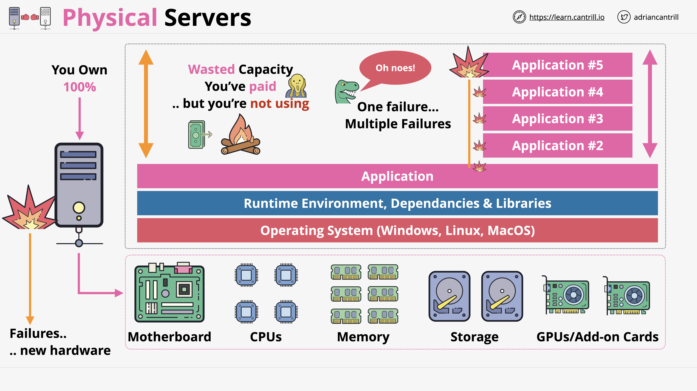
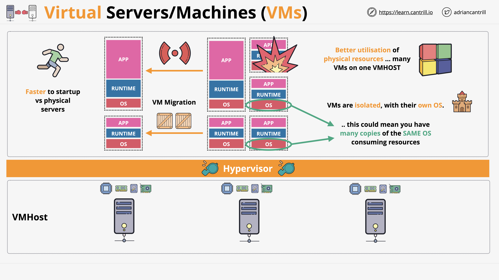

# Physical Servers vs. Virtual Machines

<a href = "https://www.techtarget.com/searchsoftwarequality/definition/runtime">*Runtime*</a>

- Easy to waste resources.

- If one application fails, the other applications fail.

- Risky investment due to the lack of scalability. 

- Physical server = VMHost

- <a href ="https://aws.amazon.com/what-is/hypervisor/#:~:text=A%20hypervisor%20is%20a%20software,individual%20virtual%20machines%20as%20required.">Hypervisor</a> - manage physical resources in the server. 

- Hypervisor - the entity that controls access to physical hardware for VMs.

- 